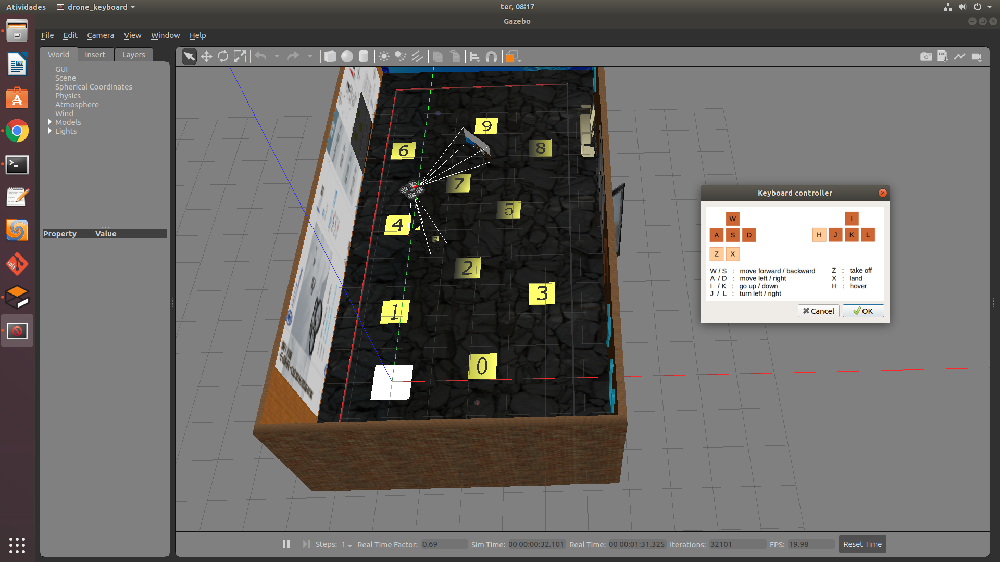

# About sjtu_drone #

This is a fork of sjtu_drone I made to fix some issues I had during instalation. I am posting this with the hope it will help somebody.
sjtu_drone is a quadrotor simulation program forked from ['tum_simulator'] (http://wiki.ros.org/tum_simulator) , which is developed with ROS + Gazebo. It is used for testing visual SLAM algorithms aiding with different sensors, such as IMU, sonar range finder and laser range finder. The 'sjtu' means Shanghai Jiao Tong University. 


# Requirements #

This package is compatible with ROS Melodic version (wich needs Ubuntu 18.04). I tested this inside a Virtualbox virtual machine with 20 Gb of free disk space, 8192 MB of memory, 4 CPUs, Hiper-v (because it was running inside windows 10) and 128 Mb of video memory with 3D acceleration. I belive it would perform better on a real machine, but it worked for me.

Please install ubuntu 18.04 default desktop instalation and install the ROS Melodic full installation, which comes with the gazebo 9 by default:

```
$ sudo sh -c 'echo "deb http://packages.ros.org/ros/ubuntu $(lsb_release -sc) main" > /etc/apt/sources.list.d/ros-latest.list'
$ sudo apt-key adv --keyserver 'hkp://keyserver.ubuntu.com:80' --recv-key C1CF6E31E6BADE8868B172B4F42ED6FBAB17C654
$ sudo apt update
$ sudo apt install ros-melodic-desktop-full
$ echo "source /opt/ros/melodic/setup.bash" >> ~/.bashrc
$ source ~/.bashrc
$ sudo apt install python-rosdep python-rosinstall python-rosinstall-generator python-wstool build-essential
$ sudo rosdep init
$ rosdep update
```
Then configure the environment:

```
$ mkdir -p ~/catkin_ws/src
$ cd ~/catkin_ws/
$ catkin_make
$ source devel/setup.bash

```
This shoud be all you need to start.

# Download and Compiling #
```
$ cd ~/catkin_ws/src
$ git clone https://github.com/lrmcbr/sjtu-drone.git
$ cd ..
$ catkin_make
```

# Run
The simplest way is calling after you have built the workspace successfully.

```
$ export ROS_PACKAGE_PATH="$HOME/catkin_ws/src/sjtu-drone/":$ROS_PACKAGE_PATH
$ roslaunch sjtu_drone simple.launch
```
This would open Gazebo with a stopped simulation. Use mouse to change view position.

**Press play button to start it.**

# Running with keyboard
In second terminal:

```
$ export ROS_PACKAGE_PATH="$HOME/catkin_ws/src/sjtu-drone/":$ROS_PACKAGE_PATH
$ rosrun sjtu_drone drone_keyboard
```

Then select the keyboard control ui and press Z to takeoff.



Good luck!

